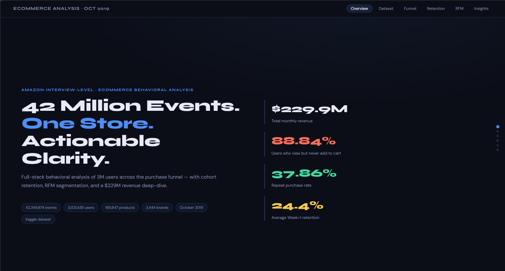
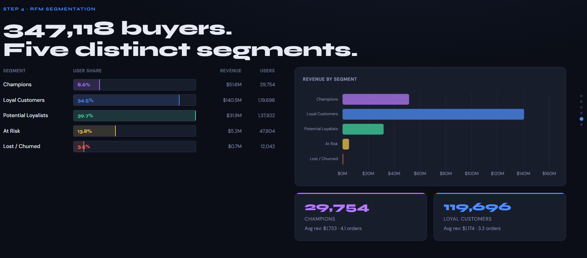

# Funnel & Retention Analysis
---

## Pipeline

```
Raw CSV (9 GB)
    │
    ▼
[Chunked Loading] ──► Pandas DataFrame (500K–2M rows in memory)
    │
    ▼
[Data Cleaning] ──► Dedup, null removal, type validation, timezone normalization
    │
    ▼
[Feature Engineering] ──► date, hour, day_of_week, week, is_weekend, top_category
    │
    ├──► [EDA] ──────────────► Daily/hourly patterns, price distribution, top brands/categories
    │
    ├──► [Funnel Analysis] ──► View→Cart→Purchase CVRs, drop-off rates, daily CVR trend
    │
    ├──► [Cohort Retention] ──► Retention matrix, heatmap, retention curves, avg W+1/W+2
    │
    ├──► [KPI Computation] ──► 13 business metrics, KPI card visualizations
    │
    ├──► [RFM Segmentation] ──► 5 customer segments, revenue by segment, RFM scatter
    │
    ├──► [Advanced Analysis] ──► Category CVR, brand revenue, day×hour heatmap, rolling revenue
    │
    └──► [Insights + Recs] ──► 7 insights, 7 recommendations
```
---

## Project Overview




Behavioral analytics pipeline on an eCommerce dataset containing **285 million user events** from a large multi-category online store. It covers funnel analysis, cohort retention, RFM segmentation, KPI dashboards, and strategic recommendations.

**Potential answers to:**
- Where are users dropping off in the purchase funnel?
- Which user cohorts retain the best after acquisition?
- Who are the most valuable customers (RFM)?
- What is the estimated revenue impact of each recommendation?

---

## Dataset

| Property | Value |
|----------|-------|
| **Source** | [Kaggle — eCommerce Behavior Data from Multi-Category Store](https://www.kaggle.com/mkechinov/ecommerce-behavior-data-from-multi-category-store) |
| **Provider** | Open CDP Project / REES46 Marketing Platform |
| **Time Span** | October 2019 – April 2020 (7 months) |
| **Total Events** | 285,000,000+ rows |
| **File Size** | ~9 GB per monthly CSV |
| **License** | Free to use with attribution |


### Schema

| Column | Type | Description |
|--------|------|-------------|
| `event_time` | datetime (UTC) | When the event occurred |
| `event_type` | string | One of: `view`, `cart`, `remove_from_cart`, `purchase` |
| `product_id` | int | Unique product identifier |
| `category_id` | int | Numeric category identifier |
| `category_code` | string | Hierarchical category name (e.g. `electronics.smartphone`) |
| `brand` | string | Lowercase brand name (nullable) |
| `price` | float | Product price in USD |
| `user_id` | int | Permanent user identifier |
| `user_session` | string | Temporary session ID (resets on long inactivity) |

---

## Project Structure

```
ecom/                        
├── ecommerce_funnel_analysis.ipynb 
├── results (png files)       
├── README.md                       
└── presentation.html                    
```

---

## Definitions & Concepts

### Funnel Analysis
A method to measure how users progress through sequential steps of a user journey. Each stage shows fewer users than the previous because some drop off. Drop-off rate = 100% − conversion rate to next stage.

### Cohort Analysis
Grouping users by a shared characteristic at a point in time and tracking their behavior over time. Reveals patterns invisible in aggregate: e.g., a campaign that acquires many users who all churn quickly will look bad in cohort view but fine in aggregate.

### Retention Rate
The percentage of users from a cohort who are still active (performing any event) in a given subsequent time period. Formula: `(Active users in week W+n) / (Users acquired in week W) × 100`.

### Churn Rate
The inverse of retention: `100% − Retention Rate`. A high churn rate at W+1 means most users never return after their first session.

### Conversion Rate (CVR)
The percentage of users who complete a desired action. In this context: the % of product viewers who eventually purchase. `CVR = Purchasers / Viewers × 100`.

### Cart Abandonment Rate
`(Users who added to cart but did NOT purchase) / (Users who added to cart) × 100`. Global e-commerce average is ~70%. Lower is better.

### Average Order Value (AOV)
`Total Revenue / Number of Purchases`. A key metric for measuring revenue efficiency, can be improved through cross-selling, upselling or bundle discounts.

### Bounce Rate 
Users who only performed `view` events and never added to cart or purchased. Measures behavioral non-engagement.

### RFM (Recency, Frequency, Monetary)
- **Recency**: How recently did the user last purchase? Recent buyers are more likely to respond to campaigns.
- **Frequency**: How often do they purchase? High frequency buyers are loyalists.
- **Monetary**: How much do they spend in total? High monetary users drive disproportionate revenue.

### Cohort Heatmap
A grid where each row is an acquisition cohort (e.g. Week 44), each column is a week offset (W+0, W+1, ...), and each cell shows retention % for that cohort at that week. Green = high retention, red = low.

### Sessions per User
`Total unique sessions / Total unique users`. Measures engagement depth: a user who visits multiple times per month has higher sessions/user.

---
